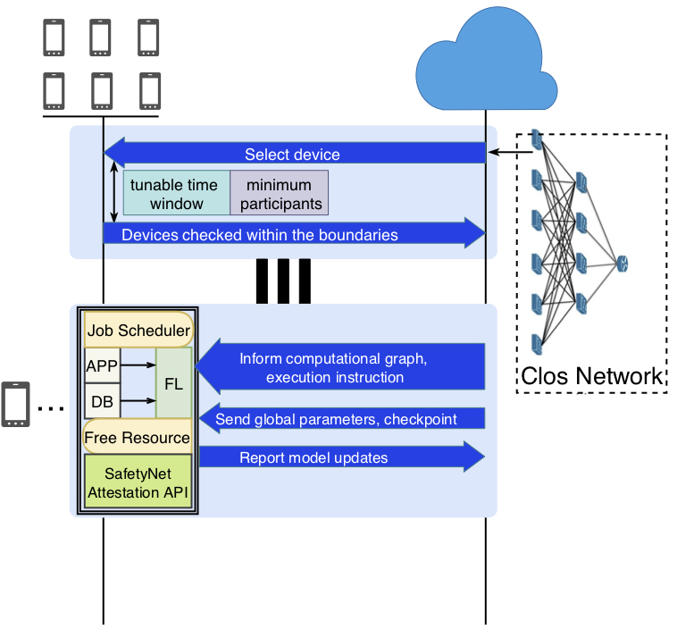

System
======

Overview
--------

   
|

Model selection
---------------

Currently none of the major libs such as TFF, PySyft and Fate support android dev. 
Therefore we target at developing FL based on `DL4J <https://deeplearning4j.org/>`_

* UE: `DL4J <https://deeplearning4j.org/>`_
                        B plan: `TensorFlow Lite <https://www.tensorflow.org/lite/>`_
|

* Trainer: `DL4J <https://deeplearning4j.org/>`_
                        B plan: `TensorFlow <https://www.tensorflow.org/>`_
|

* Cloud: `TDL4J <https://deeplearning4j.org/>`_
                        B plan: `TensorFlow <https://www.tensorflow.org/>`_
