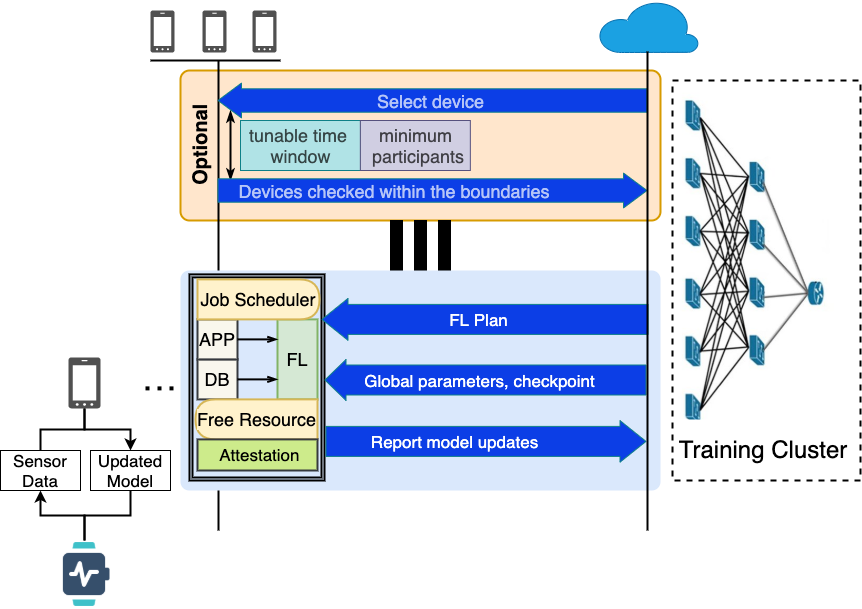

System
======

Overview
--------

   
|

Implementation
---------------

We are developing based on OpenMined libraries._

* UE: `TBD`_
                        B plan: `TensorFlow Lite <https://www.tensorflow.org/lite/>`_
|

* Trainer: `KotlinSyft <https://github.com/OpenMined/KotlinSyft>`_
|

* Cloud: `PySyft <https://github.com/OpenMined/PySyft>`_
